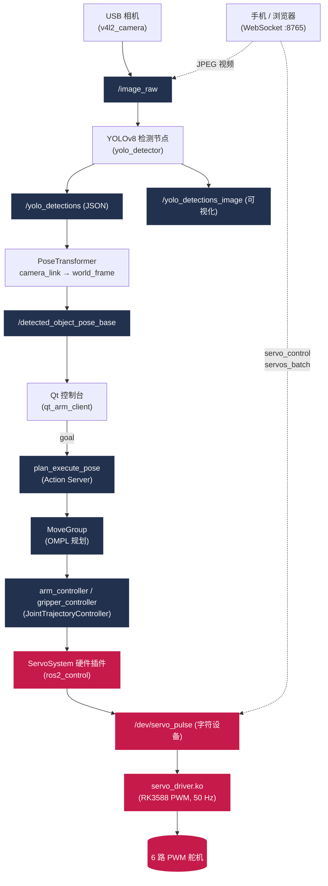

# RobotArm

<p align="center">
  一套基于 <strong>ROS 2 Humble + MoveIt 2</strong> 的桌面级机械臂项目，集成 YOLOv8 视觉感知、Qt 控制台、ros2_control 硬件抽象与自研 Linux PWM 内核驱动，运行于 <strong>Orange Pi 5（RK3588）</strong>。
</p>

<p align="center">
  <a href="./LICENSE"></a>
  
  
  
  
  
</p>

---

## 目录

- [项目简介](#项目简介)
- [系统架构](#系统架构)
- [功能特性](#功能特性)
- [硬件清单](#硬件清单)
- [仓库结构](#仓库结构)
- [环境依赖](#环境依赖)
- [编译安装](#编译安装)
- [快速开始](#快速开始)
- [视觉感知模块](#视觉感知模块)
- [WebSocket 远程控制](#websocket-远程控制)
- [ROS 接口一览](#ros-接口一览)
- [内核驱动（PWM 舵机）](#内核驱动pwm-舵机)
- [已知问题与注意事项](#已知问题与注意事项)
- [许可证](#许可证)

---

## 项目简介

RobotArm 是一个面向学习与研究的完整机械臂软件栈，覆盖了从**底层舵机驱动**到**高层视觉抓取规划**的全链路：

- **5 自由度机械臂 + 单指夹爪**，共 6 个驱动关节；
- 通过自研 **Linux 内核 PWM 驱动**（`servo_driver.ko`）驱动 6 路 hobby 舵机；
- 基于 **ros2_control** 的硬件抽象层 `ServoSystem`，将关节角度映射为 PWM 脉宽；
- **MoveIt 2** 提供运动规划、运动学求解（KDL）与轨迹执行；
- 自定义 **`PlanExecutePose` Action** 接口，统一规划与执行；
- **YOLOv8** 实时目标检测 + TF2 坐标变换，闭环“看到 → 抓到”；
- **Qt5 控制台**提供可视化目标位姿输入，并自动回填视觉检测结果；
- **WebSocket 服务**让手机 / 浏览器远程查看视频并直接下发舵机指令。

> 📌 该机械臂运动学为 **5-DOF**（无法完全控制末端 Roll），因此末端姿态容差较大（0.5 rad），使用近似逆解（Approximate IK）。

---

## 系统架构

下图展示从相机采集到舵机动作的完整数据流，以及 WebSocket 远程直控旁路：



---

## 功能特性

- 🦾 **5-DOF 机械臂 + 夹爪**，URDF/SRDF 完整建模，含碰撞自屏蔽。
- 🧠 **MoveIt 2 运动规划**：OMPL 几何规划器全家桶 + KDL 运动学 + 近似 IK。
- 🎯 **统一 Action 接口** `PlanExecutePose`：一次调用完成“规划 + 执行 + 反馈”。
- 👁️ **YOLOv8 视觉**：内置 COCO（`yolov8n.pt`）与 YCB 物体集（`ycbv8n.pt`）两个模型，可热切换。
- 🔁 **手眼标定与 TF 变换**：相机坐标自动转换到机械臂基坐标系。
- 🖥️ **Qt5 可视化控制台**：位姿/姿态数值输入、夹爪开合、速度缩放、实时日志，支持视觉结果一键回填。
- 📱 **WebSocket 远程控制**：浏览器/手机实时图传 + 舵机直控，便于脱机调试。
- ⚙️ **自研内核驱动**：基于 RK3588 PWM 子系统的多路舵机驱动，标准 50 Hz 周期。
- 🧪 **干跑模式（`dry_run`）**：无需硬件即可在 PC 上跑通整个 ROS 2 + MoveIt 流程。

---

## 硬件清单

| 部件 | 说明 |
| --- | --- |
| **主控板** | Orange Pi 5（Rockchip RK3588），运行 Ubuntu 22.04 |
| **执行器** | 6 路 hobby PWM 舵机（基座 / 肩 / 肘 / 腕1 / 腕2 / 夹爪） |
| **相机** | USB 摄像头（`/dev/video0`，640×480） |
| **PWM 通道** | 经设备树映射到 RK3588 PWM 控制器，周期 20 ms（50 Hz） |

> 仅做仿真/规划调试时，任意安装了 ROS 2 Humble 的 PC 即可，无需上述硬件。

---

## 仓库结构

```text
RobotArm/
├── driver/                     # Linux 内核 PWM 舵机驱动 + sysfs 调试工具
│   ├── servo_driver.c          #   平台驱动，生成 /dev/servo_pulse
│   ├── servo_pulse_debug.c     #   用户态 sysfs 手动标定工具
│   └── Makefile                #   针对 RK3588 内核头编译
│
├── my_arm_description/         # 机器人模型 (ament_cmake)
│   └── urdf/my_arm_with_gripper.urdf
│
├── my_arm_hw/                  # ros2_control 硬件插件 (ament_cmake)
│   ├── include/.../servo_system.hpp
│   ├── src/servo_system.cpp    #   ServoSystem: 角度↔脉宽映射
│   └── plugin.xml              #   插件: my_arm_hw/ServoSystem
│
├── my_arm_config/              # MoveIt 配置 + 运动服务 + Qt GUI (ament_cmake)
│   ├── action/PlanExecutePose.action
│   ├── src/
│   │   ├── moveit_motion_server.cpp   #   plan_execute_pose Action 服务端
│   │   └── qt_arm_app.cpp             #   qt_arm_client 控制台
│   ├── launch/*.launch.py             #   demo / move_group / qt_control ...
│   └── config/*.yaml                  #   控制器 / 运动学 / 关节限位 / RViz
│
├── my_arm_vision/              # 视觉感知 (ament_python)
│   ├── my_arm_vision/
│   │   ├── yolo_detector.py
│   │   ├── pose_transformer.py
│   │   └── websocket_server.py
│   ├── model/                  #   yolov8n.pt, ycbv8n.pt
│   ├── config/                 #   相机标定 / 手眼标定
│   └── launch/*.launch.py
│
├── LICENSE                     # Apache-2.0
└── README.md
```

---

## 环境依赖

已在以下环境验证：

- **OS**：Ubuntu 22.04 LTS
- **ROS 2**：Humble Hawksbill
- **MoveIt 2**（Humble 对应版本）
- **Qt**：Qt 5（Widgets）
- **Python**：3.10 + `ultralytics`、`opencv-python`、`websockets`
- **内核头**：`linux-headers-5.10.160-rockchip-rk3588`（仅编译内核驱动时需要）

安装 ROS 2 与 MoveIt 2（如尚未安装）：

```bash
sudo apt update
sudo apt install ros-humble-desktop ros-humble-moveit ros-humble-ros2-control ros-humble-ros2-controllers \
                 ros-humble-joint-state-publisher-gui ros-humble-v4l2-camera ros-humble-cv-bridge
```

安装视觉节点 Python 依赖：

```bash
pip install ultralytics opencv-python websockets
```

---

## 编译安装

> 本仓库的包位于仓库根目录，建议将其克隆到 colcon 工作空间的 `src/` 下。

```bash
# 1. 创建工作空间
mkdir -p ~/arm_ws/src && cd ~/arm_ws/src

# 2. 克隆仓库
git clone https://github.com/Sherlock-evolve/RobotArm.git

# 3. 编译（在工作空间根目录执行）
cd ~/arm_ws
colcon build --symlink-install

# 4. source 环境
source install/setup.bash
```

如只构建单个包（加快迭代）：

```bash
colcon build --symlink-install --packages-select my_arm_description my_arm_hw my_arm_config my_arm_vision
```

---

## 快速开始

### 方式一：纯仿真（无需硬件，PC 即可）

```bash
source ~/arm_ws/install/setup.bash

# (a) MoveIt 演示：RViz 中拖拽规划
ros2 launch my_arm_config demo.launch.py

# (b) 仅查看 URDF 模型（带关节滑块）
ros2 launch my_arm_config display.launch.py

# (c) 完整体验：MoveIt + 运动服务 + Qt 控制台
ros2 launch my_arm_config qt_control.launch.py
```

`qt_control.launch.py` 会启动：demo 配置 + `moveit_motion_server`（planning_group=`arm`）+ `qt_arm_client` 图形界面。

在 Qt 控制台中输入目标位姿（X/Y/Z、Roll/Pitch/Yaw），点击 **Plan & Execute** 即可规划并运动到目标。

### 方式二：真实硬件（Orange Pi 5）

```bash
# 1. 编译并加载内核驱动（产生 /dev/servo_pulse）
cd ~/arm_ws/src/RobotArm/driver
make
sudo insmod servo_driver.ko
ls -l /dev/servo_pulse            # 确认字符设备已生成

# 2. （可选）sysfs 手动标定各舵机零位 / 行程
sudo ./servo_pulse_debug

# 3. 关闭 dry_run，使能真实硬件
#    编辑 my_arm_config/config/hardware_params.yaml: dry_run: false

# 4. 启动完整控制栈
ros2 launch my_arm_config qt_control.launch.py

# 5. 检查控制器状态
ros2 control list_controllers
#   期望输出：arm_controller / gripper_controller / joint_state_broadcaster 均 active
```

> 若 `dry_run: true`（默认便于 PC 调试），硬件插件不会打开 `/dev/servo_pulse`，仅打印角度→脉宽映射。

---

## 视觉感知模块

### YOLOv8 目标检测

```bash
ros2 launch my_arm_vision camera_yolo_detection.launch.py
# 可选参数：video_device / camera_name / model_path / conf_threshold
# 例：切换到 YCB 物体模型
ros2 launch my_arm_vision camera_yolo_detection.launch.py model_path:=ycbv8n.pt
```

输出话题：

| 话题 | 类型 | 说明 |
| --- | --- | --- |
| `/yolo_detections` | `std_msgs/String` | JSON：bbox / 置信度 / 类别 |
| `/yolo_detections_image` | `sensor_msgs/Image` | 叠加检测框的可视化图像 |

### 坐标变换（相机系 → 基座系）

`pose_transformer` 通过 TF2 把 `/detected_object_pose_camera` 变换到 `world_frame`，发布到 `/detected_object_pose_base`。Qt 控制台订阅该话题，**自动回填目标位姿并切换到 `arm` 规划组**，从而闭合“看见 → 抓取”回路。

---

## WebSocket 远程控制

启动 WebSocket 桥接服务，可在浏览器/手机上实时查看相机画面并直接控制舵机（绕过 ros2_control 的低层直控通道）：

```bash
ros2 launch my_arm_vision websocket_server.launch.py
# 默认：ws://0.0.0.0:8765 ， 视频话题 /image_raw , 30 FPS
```

| 参数 | 默认值 | 说明 |
| --- | --- | --- |
| `host` | `0.0.0.0` | 监听地址 |
| `port` | `8765` | 监听端口 |
| `video_topic` | `/image_raw` | 推送的图像话题 |
| `servo_device` | `/dev/servo_pulse` | 舵机字符设备 |
| `video_fps` | `30` | 推流帧率 |

下行指令为 JSON：

```jsonc
// 单舵机控制（servo_id 0-5, pulse_ns 400000-2600000）
{ "type": "servo_control", "servo_id": 0, "pulse_ns": 1500000 }

// 批量控制
{ "type": "servos_batch", "servos": [
    {"servo_id": 0, "pulse_ns": 1500000},
    {"servo_id": 5, "pulse_ns": 2000000} ] }
```

参考客户端：`my_arm_vision/test_websocket_client.html`。

---

## ROS 接口一览

### 关节定义

| 关节 | 轴向 | 行程 (rad) |
| --- | --- | --- |
| `shoulder_pan_joint` | Z（偏航） | [-0.05, 3.05] |
| `shoulder_lift_joint` | X（俯仰） | [-1.75, 1.05] |
| `elbow_joint` | X（俯仰） | [-1.10, 1.05] |
| `wrist_1_joint` | X（俯仰） | [-1.10, 1.60] |
| `wrist_2_joint` | Z（偏航） | [-1.05, 2.05] |
| `finger_joint`（夹爪） | Z | [-0.05, 1.65] |

- **规划组**：`arm`（链 `base_link` → `grasp_point_link`）、`gripper`（`finger_joint`）
- **基坐标系 / 世界系**：`world_frame`（== `base_link`）
- **末端 TCP**：`grasp_point_link`

### 控制器

| 控制器 | 类型 | 控制关节 |
| --- | --- | --- |
| `arm_controller` | `joint_trajectory_controller/JointTrajectoryController` | 5 个手臂关节 |
| `gripper_controller` | `joint_trajectory_controller/JointTrajectoryController` | `finger_joint` |
| `joint_state_broadcaster` | `joint_state_broadcaster/JointStateBroadcaster` | 全部 |

控制器管理器更新频率 **50 Hz**，与舵机 PWM 周期一致。

### Action：`my_arm_config/action/PlanExecutePose`

**话题名**：`plan_execute_pose`

```text
# Goal
geometry_msgs/PoseStamped target_pose
string planning_group            # "arm" 或 "gripper"
float64 gripper_position
float64 velocity_scaling
float64 acceleration_scaling
bool execute
bool wait_for_execution
---
# Result
bool success
string message
---
# Feedback
string status
float32 progress
```

---

## 内核驱动（PWM 舵机）

`driver/servo_driver.c` 是一个 Linux 平台驱动模块：

- **设备树兼容字符串**：`orangepi,servo-pulse`
- **PWM 周期**：20 ms（50 Hz），占空比 = 舵机脉宽
- **字符设备**：`/dev/servo_pulse`，仅支持 `write`，格式 `"<通道号> <脉宽ns>\n"`
- **通道数**：最多 6 路（`servo0`–`servo5`）
- **每通道标定**：通过设备树 `servo-min-ns` / `servo-max-ns` / `servo-zero-ns` 配置

```bash
# 手动下发脉宽测试（通道 0，1500µs）
echo "0 1500000" | sudo tee /dev/servo_pulse
```

`servo_pulse_debug.c` 是基于 sysfs（`/sys/class/pwm/`）的用户态标定工具，支持 `+`/`-` 微调、`1-6` 选通、`r` 复位零位，用于单独校准每个舵机。

---

## 已知问题与注意事项

- **运动学为 5-DOF**：末端姿态容差较大（0.5 rad）并启用近似 IK，目标 Roll 分量通常不可达。
- **`planning_group` 默认值不一致**：运动服务节点默认参数为 `manipulator`，但 SRDF 中实际只定义了 `arm` 与 `gripper`；`qt_control.launch.py` 已显式覆盖为 `arm`，直接调用 Action 时请传入 `arm` 或 `gripper`。
- **手眼标定文件**：`my_arm_vision/config/my_handeye.calib` 中 `move_group` 写为 `manipulator`、引用了 `aruco_marker_frame`，二者在当前 SRDF/TF 中未定义，正式使用前需更新。
- **混合许可证**：根 `LICENSE` 为 Apache-2.0，各子包声明各异（详见 [许可证](#许可证)）。

---

## 许可证

本仓库根目录采用 **[Apache License 2.0](./LICENSE)**。

各子包按自身声明为准：

| 组件 | 许可证 |
| --- | --- |
| `my_arm_hw` | Apache-2.0 |
| `my_arm_description` | BSD-3-Clause |
| `my_arm_config` | BSD |
| `my_arm_vision` | MIT |
| `driver/servo_driver.c`（内核模块） | GPL |

> 内核模块受 Linux 内核的 GPL 许可约束，与用户态包的许可证相互独立。
